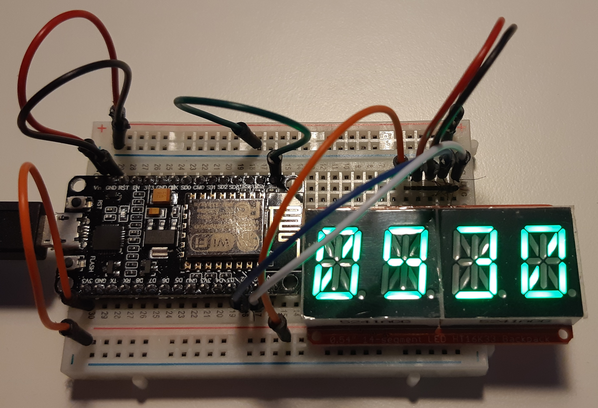

# Horloge

<!--
*** Thanks for checking out the Best-README-Template. If you have a suggestion
*** that would make this better, please fork the repo and create a pull request
*** or simply open an issue with the tag "enhancement".
*** Thanks again! Now go create something AMAZING! :D
***
***
***
*** To avoid retyping too much info. Do a search and replace for the following:
*** github_username, repo_name, twitter_handle, email, project_title, project_description
-->


<!-- PROJECT SHIELDS -->
<!--
*** I'm using markdown "reference style" links for readability.
*** Reference links are enclosed in brackets [ ] instead of parentheses ( ).
*** See the bottom of this document for the declaration of the reference variables
*** for contributors-url, forks-url, etc. This is an optional, concise syntax you may use.
*** https://www.markdownguide.org/basic-syntax/#reference-style-links
-->
[![Contributors][contributors-shield]][contributors-url]
[![Forks][forks-shield]][forks-url]
[![Stargazers][stars-shield]][stars-url]
[![Issues][issues-shield]][issues-url]
[![License][license-shield]][license-url]
[![Twitter][twitter-shield]][twitter-url]

<!-- [![LinkedIn][linkedin-shield]][linkedin-url] -->


<!-- PROJECT LOGO -->
<br />
<p align="center">
  <a href="https://github.com/Marcussacapuces91/Horloge">
    
  </a>

  <h3 align="center">Horloge</h3>

  <p align="center">
    Horloge numérique utilisant principalement un ESP8266 et un afficheur HT16K33 (4 chiffres à 14 segments)
    <br />
    <a href="https://github.com/Marcussacapuces91/Horloge"><strong>Explorer la doc »</strong></a>
    <br />
    <br />
    <a href="https://github.com/Marcussacapuces91/Horloge">View Demo</a>
    ·
    <a href="https://github.com/Marcussacapuces91/Horloge/issues">Déclarer un Bug</a>
    ·
    <a href="https://github.com/Marcussacapuces91/Horloge/issues">Proposer une fonctionnalité</a>
  </p>
</p>


<!-- TABLE OF CONTENTS -->
<details open="open">
  <summary><h2 style="display: inline-block">Table de matière</h2></summary>
  <ol>
    <li>
      <a href="#a-propos">À propos</a>
      <ul>
        <li><a href="#depenances">Dépendances</a></li>
      </ul>
    </li>
    <li>
      <a href="#getting-started">Getting Started</a>
      <ul>
        <li><a href="#prerequisites">Prerequisites</a></li>
        <li><a href="#installation">Installation</a></li>
      </ul>
    </li>
    <li><a href="#utilisation">Utilisation</a></li>
    <li><a href="#feuille-de-route">Feuille de route</a></li>
    <li><a href="#contribuer">Contribuer</a></li>
    <li><a href="#licence">Licence</a></li>
    <li><a href="#contact">Contact</a></li>
    <li><a href="#remerciements">Remerciements</a></li>
  </ol>
</details>


<!-- ABOUT THE PROJECT -->
## À propos




<!-- Build with -->
### Dépendances

* [Arduino<sup>&copy;</sup> IDE](https://www.arduino.cc/en/software) ;
* [NTPClient](https://github.com/arduino-libraries/NTPClient) ;
* [WiFiUdp](https://github.com/esp8266/Arduino/blob/master/libraries/ESP8266WiFi/src/WiFiUdp.h) ;
* [ESP8266WiFi](https://arduino-esp8266.readthedocs.io/en/latest/index.html) ;
* [Adafruit LEDBackpack](https://github.com/adafruit/Adafruit_LED_Backpack) ;
* [LittleFS](https://github.com/littlefs-project/littlefs) ;
* [ESP8266WebServer](https://github.com/esp8266/Arduino/blob/master/libraries/ESP8266WebServer/src/ESP8266WebServer.h) ;
* [ArduinoJson](https://arduinojson.org/).


<!-- GETTING STARTED -->
## Getting Started

To get a local copy up and running follow these simple steps.

### Prerequisites

This is an example of how to list things you need to use the software and how to install them.
* npm
  ```sh
  npm install npm@latest -g
  ```

### Installation

1. Clone the repo
   ```sh
   git clone https://github.com/Marcussacapuces91/Horloge.git
   ```
2. Install NPM packages
   ```sh
   npm install
   ```


<!-- USAGE EXAMPLES -->
## Utilisation

> Mettre ici des exemples pour montrer comment utiliser ce projet. Des copies d'écran, des exemples de code et des démos dans cet espace. On peut aussi y ajouter des liens vers d'autres ressources.

<!-- Pour plus d'exemples, voir aussi [Documentation](https://example.com) -->


<!-- ROADMAP -->
## Feuille de route

Voir les [Points ouverts (_issues_)](https://github.com/Marcussacapuces91/Horloge/issues) pour connaître la liste des fonctionnalités à venir ()et des problèmes rencontrés).


<!-- CONTRIBUTING -->
## Contribuer

Les contributions sont ce qui rend la communauté _Open Source_ un si magnifique lieu de création, d'inspiration et d'apprentissage. Toutes les contributions que vous pouvez faire pour ce projet seront **grandement appréciées**.

1. _Forker_ le présent projet ;
2. Créer votre branche de fonctionnalité (`git checkout -b feature/AmazingFeature`) ;
3. Commiter vos modifications (`git commit -m 'Ajout d’une AmazingFeature'`) ;
4. Pousser dans la branche (`git push origin feature/AmazingFeature`) ;
5. Ouvrir un _Pull Request_.


<!-- LICENSE -->
## Licence

Tous les fichiers sont distribués sous licence **Apache 2.0** sauf indication contraire dans le document. Voir le fichier [`LICENSE`](https://github.com/Marcussacapuces91/Horloge/blob/main/LICENSE) pour plus d'information.


<!-- CONTACT -->
## Contact

* Marc SIBERT - [@LabAllen91](https://twitter.com/LabAllen91) - contact@lab-allen.fr
* Lien projet : [https://github.com/Marcussacapuces91/Horloge](https://github.com/Marcussacapuces91/Horloge)


<!-- ACKNOWLEDGEMENTS -->
## Remerciements

* []()
* []()
* []()


<!-- MARKDOWN LINKS & IMAGES -->
<!-- https://www.markdownguide.org/basic-syntax/#reference-style-links -->
[contributors-shield]: https://img.shields.io/github/contributors/Marcussacapuces91/Horloge.svg?style=for-the-badge&label=Contributeurs
[contributors-url]: https://github.com/Marcussacapuces91/Horloge/graphs/contributors
[forks-shield]: https://img.shields.io/github/forks/Marcussacapuces91/Horloge.svg?style=for-the-badge&label=Forks
[forks-url]: https://github.com/Marcussacapuces91/Horloge/network/members
[stars-shield]: https://img.shields.io/github/stars/Marcussacapuces91/Horloge.svg?style=for-the-badge&logo=GitHub
[stars-url]: https://github.com/Marcussacapuces91/Horloge/stargazers
[issues-shield]: https://img.shields.io/github/issues/Marcussacapuces91/Horloge.svg?style=for-the-badge&label=Anomalies
[issues-url]: https://github.com/Marcussacapuces91/Horloge/issues
[license-shield]: https://img.shields.io/github/license/Marcussacapuces91/Horloge.svg?style=for-the-badge
[license-url]: https://github.com/Marcussacapuces91/Horloge/blob/master/LICENSE
[twitter-shield]: https://img.shields.io/twitter/follow/LabAllen91?label=Suivre&style=for-the-badge&logo=Twitter
[twitter-url]: https://twitter.com/LabAllen91

[linkedin-shield]: https://img.shields.io/badge/-LinkedIn-black.svg?style=for-the-badge&logo=linkedin&colorB=555
[linkedin-url]: https://linkedin.com/in/Marcussacapuces91
